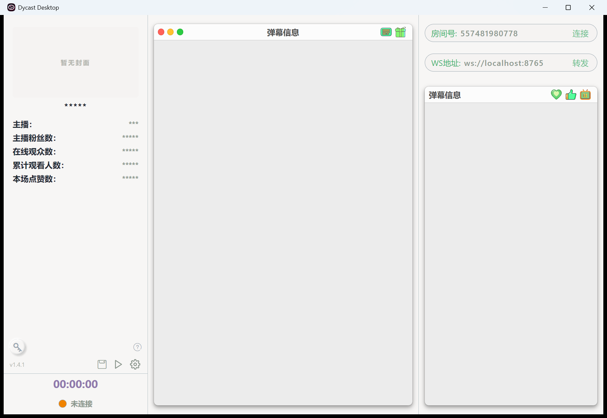
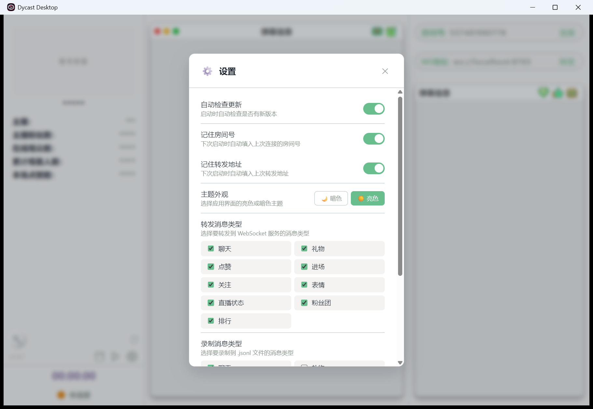
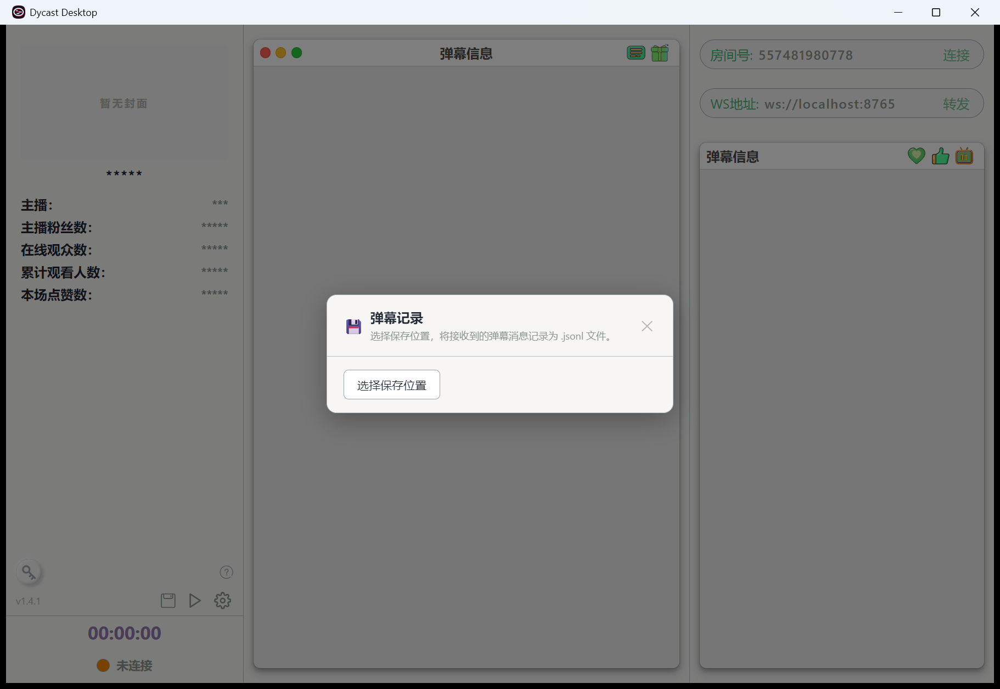
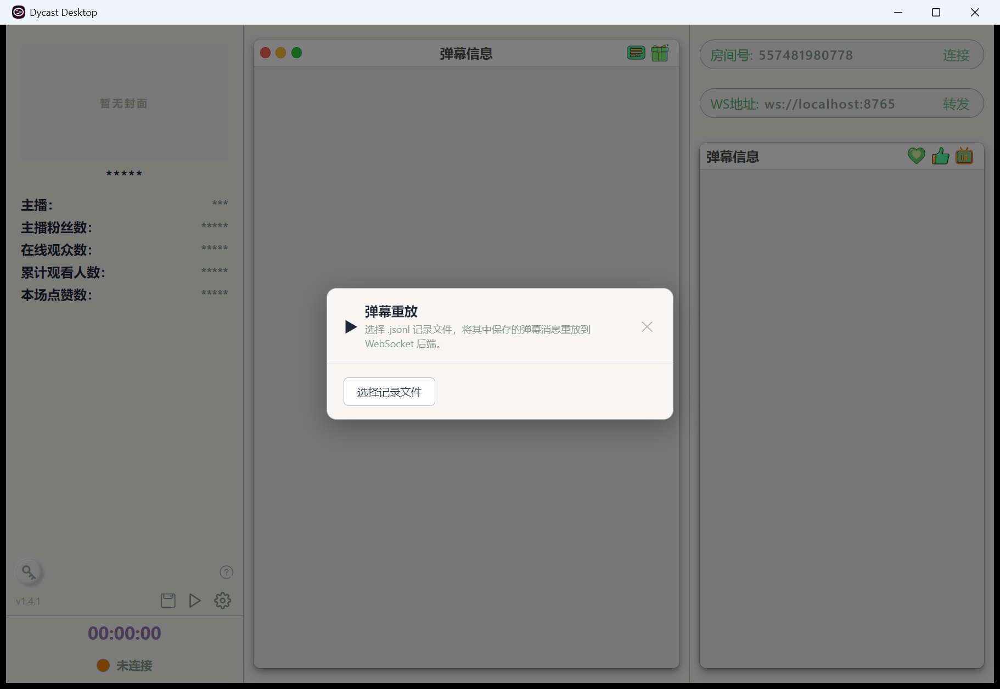

<div align="center">
  
  <h1>Dycast Desktop</h1>
  <p><strong>轻量、原生的抖音直播弹幕采集与转发工具</strong></p>
  <p>连接直播间，实时查看弹幕与房间状态，并将结构化消息转发、录制或重放到你的直播互动系统。</p>
  <p>
    <a href="https://github.com/qinant/dycast-desktop/releases/latest"></a>
    <a href="https://github.com/qinant/dycast-desktop/actions"></a>
    <a href="./LICENSE"></a>
    <a href="https://v2.tauri.app/"></a>
    <a href="https://vuejs.org/"></a>
  </p>
  <p>
    <a href="https://github.com/qinant/dycast-desktop/releases/latest">下载安装</a> ·
    <a href="#快速开始">快速开始</a> ·
    <a href="#websocket-转发协议">数据协议</a> ·
    <a href="#本地开发">参与开发</a>
  </p>
</div>



## 为什么使用 Dycast Desktop

Dycast Desktop 是基于 [skmcj/dycast](https://github.com/skmcj/dycast) 独立维护的桌面端项目。它把抖音直播间的连接、protobuf 解码、消息展示和下游集成封装在一个开箱即用的应用中，无需浏览器脚本，也不要求业务系统直接处理直播协议。

| 能力 | 说明 |
| --- | --- |
| 实时弹幕 | 展示聊天、Emoji、礼物、点赞、关注、进场、粉丝团、榜单及房间状态 |
| 房间概览 | 展示封面、主播信息、在线人数、累计观众、关注数和点赞数 |
| WebSocket 转发 | 将结构化 JSON 消息实时转发到任意 `ws://` 或 `wss://` 服务 |
| JSONL 录制 | 流式写入本地文件，不在前端内存中堆积全量历史消息 |
| 弹幕重放 | 按原始时间间隔将录制内容重放到 WebSocket 后端，便于联调和演示 |
| 消息过滤 | 分别配置需要转发和录制的消息类型 |
| 稳定连接 | 10 秒心跳、消息健康探测、异常断开自动重连（最多 3 次） |
| 桌面体验 | 亮色/暗色主题、配置持久化、跨平台构建和应用内更新 |

## 界面与工作流

### 一处配置，控制转发与录制

自动更新、房间号记忆、转发地址、主题和消息类型均可在设置中管理。转发过滤与录制过滤互相独立，避免把无关的高频消息发送给下游。



### 录制真实流量，随时重放

<table>
  <tr>
    <td width="50%"></td>
    <td width="50%"></td>
  </tr>
  <tr>
    <td align="center">将接收到的消息持续写入 <code>.jsonl</code></td>
    <td align="center">按原始间隔重放到 WebSocket 服务</td>
  </tr>
</table>

这套流程适合直播互动程序、可视化大屏、机器人和数据处理服务的离线调试：先录制一段真实弹幕，再反复重放，不必每次等待直播间产生新消息。

## 快速开始

### 1. 安装应用

前往 [Releases](https://github.com/qinant/dycast-desktop/releases/latest) 下载适合当前系统的安装包：

- Windows：优先选择 `.msi` 或 `-setup.exe`
- macOS：选择对应架构的 `.dmg`
- Linux：选择 `.AppImage` 或 `.deb`

> 应用会在启动时检查新版本；也可以在设置中关闭自动检查或手动检查更新。

### 2. 连接直播间

1. 启动 Dycast Desktop。
2. 在右上角输入抖音直播间房间号，点击「连接」。
3. 连接成功后，中间区域显示聊天和礼物，右侧区域显示点赞、关注和进场等消息。
4. 点击列表标题栏中的图标，可快速筛选当前显示的消息类型。

房间号通常可以从直播间 URL 中取得。例如 `https://live.douyin.com/123456789` 的房间号为 `123456789`。

### 3. 转发到你的服务

在「WS地址」中输入接收端地址，例如 `ws://127.0.0.1:8765`，然后点击「转发」。项目附带了一个用于本地验证的 WebSocket 回显服务：

```sh
python server.py
```

服务默认监听 `8765` 端口。生产环境请使用自己的 WebSocket 服务，并根据下方协议处理消息。

### 4. 可选登录

部分消息可能需要登录态。点击左下角钥匙图标，可导入抖音 `sessionid`。凭证只用于请求抖音接口，请勿截图、分享或提交到仓库。

## WebSocket 转发协议

每个 WebSocket text message 都是一段 JSON。连接转发服务后，Dycast Desktop 会先发送一次直播间信息对象，之后发送弹幕批次数组：

```text
建立转发连接
  ├─ DyLiveInfo      直播间信息对象，只发送一次
  └─ DyMessage[]     弹幕批次数组，持续发送
```

接收端可使用 `Array.isArray(payload)` 区分两类数据。

### 直播间信息

```ts
interface DyLiveInfo {
  roomNum?: string;
  roomId: string;
  uniqueId: string;
  avatar: string;
  cover: string;
  nickname: string;
  title: string;
  status: number;
}
```

### 弹幕批次

一次 WebSocket message 对应一个数组，而非一条弹幕。数组中可能同时包含不同 `method` 的消息。

```ts
type RelayMessagePayload = DyMessage[];

interface DyMessage {
  id?: string;
  method?: CastMethod;
  user?: CastUser;
  toUser?: CastUser;
  gift?: CastGift;
  content?: string;
  rtfContent?: CastRtfContent[];
  room?: LiveRoom;
  rank?: LiveRankItem[];
}

interface CastUser {
  id?: string;
  name?: string;
  avatar?: string;
  gender?: number;
}

interface CastGift {
  id?: string;
  name?: string;
  price?: number;
  type?: number;
  desc?: string;
  icon?: string;
  count?: number | string;
  repeatEnd?: number;
}

interface LiveRoom {
  audienceCount?: number | string;
  likeCount?: number | string;
  followCount?: number | string;
  totalUserCount?: number | string;
  status?: number;
}

interface LiveRankItem {
  nickname: string;
  avatar: string;
  rank: number | string;
}
```

常见消息类型：

| `method` | 含义 | 常用字段 |
| --- | --- | --- |
| `WebcastChatMessage` | 聊天弹幕 | `user`、`content`、`rtfContent` |
| `WebcastEmojiChatMessage` | 表情弹幕 | `user`、`content` |
| `WebcastGiftMessage` | 礼物消息 | `user`、`toUser`、`gift` |
| `WebcastLikeMessage` | 点赞消息 | `user`、`content`、`room.likeCount` |
| `WebcastMemberMessage` | 用户进场 | `user`、`content`、`room.audienceCount` |
| `WebcastSocialMessage` | 关注消息 | `user`、`content`、`room.followCount` |
| `WebcastFansclubMessage` | 粉丝团消息 | `user`、`content` |
| `WebcastRoomUserSeqMessage` | 在线人数与榜单 | `room`、`rank` |
| `WebcastRoomRankMessage` | 直播间排行榜 | `rank` |
| `WebcastRoomStatsMessage` | 房间统计 | `room.audienceCount` |
| `WebcastControlMessage` | 直播状态控制 | `content`、`room.status` |

Python 接收示例：

```py
import json

async for message in websocket:
    payload = json.loads(message)

    if isinstance(payload, list):
        for item in payload:
            print(item.get("method"), item.get("content"))
    else:
        print("live info:", payload.get("roomNum"), payload.get("title"))
```

## JSONL 文件格式

录制文件采用 JSON Lines 格式，每行保存一条带 `timestamp` 的弹幕 JSON。应用使用流式写入，因此长时间录制不会把全部历史消息保留在前端内存中。

```json
{"id":"7649725129967285311","method":"WebcastChatMessage","user":{"name":"示例用户"},"content":"这是一条弹幕","timestamp":1781928000000}
```

界面列表只保留最近的消息以控制内存占用；需要完整数据时，请开启录制。

## 技术架构

```text
直播间 URL / 房间号
        │
        ▼
HTML 状态快照 ──► Cookie / IM 参数
        │
        ▼
Douyin WebSocket ──► gzip 解压 ──► protobuf 解码
                                          │
                      ┌───────────────────┼───────────────────┐
                      ▼                   ▼                   ▼
                   界面展示          WebSocket 转发        JSONL 录制
                                                               │
                                                               ▼
                                                         弹幕定时重放
```

- **桌面容器**：Tauri 2
- **前端**：Vue 3、TypeScript、Vite 6、SCSS
- **消息列表**：`vue-virtual-scroller`
- **数据处理**：原生 `DecompressionStream` / `pako` 后备、手写 protobuf 解码器
- **原生层**：Rust、reqwest、tokio-tungstenite、BufWriter
- **状态管理**：Vue reactive proxy + localStorage，无 Pinia/Vuex

Tauri 生产环境通过 Rust 中继 HTTP 和 WebSocket，并与 WebView 共享 Cookie；浏览器开发环境则通过 Vite proxy 连接抖音服务。

## 本地开发

### 环境要求

- Node.js 22+
- npm
- Rust 1.77.2+
- [Tauri 2 系统依赖](https://v2.tauri.app/start/prerequisites/)

```sh
# 安装依赖
npm install

# 完整桌面开发模式
npm run tauri-dev

# 仅启动前端，用于 UI 调试
npm run dev

# 类型检查与前端构建
npm run type-check
npm run build

# 构建本机安装包
npm run tauri-build
```

构建产物位于 `src-tauri/target/release/bundle/`。本地构建使用独立配置，不生成 updater artifacts。

### 目录说明

| 路径 | 用途 |
| --- | --- |
| `src/views/`、`src/components/` | Vue 界面与交互组件 |
| `src/core/dycast.ts` | 连接生命周期、心跳、重连和消息分发 |
| `src/core/model/` | protobuf 数据结构与懒加载解码器 |
| `src/platform/` | Tauri / Browser HTTP 与 WebSocket 适配层 |
| `src/utils/jsonlRecorder.ts` | 跨平台流式 JSONL 录制 |
| `src-tauri/src/` | HTTP、WebSocket、录制与重放的 Rust 实现 |

## 版本与贡献

版本历史见 [GitHub Releases](https://github.com/qinant/dycast-desktop/releases)，规划见 [ROADMAP.md](./ROADMAP.md)。提交信息遵循 Conventional Commits，支持以下类型：`feat`、`fix`、`perf`、`docs`、`chore`。

欢迎提交 Issue 和 Pull Request。修改 protobuf 相关逻辑时，请注意 `src/core/model/` 中的解码文件由生成流程维护，不建议直接手工编辑。

## 免责声明

本项目仅用于学习交流、桌面工具开发和合法的直播辅助场景。使用者应遵守抖音平台规则、相关法律法规和数据使用边界。因不当使用产生的风险与后果由使用者自行承担。

## License

[MIT](./LICENSE) © 2026 qinant
